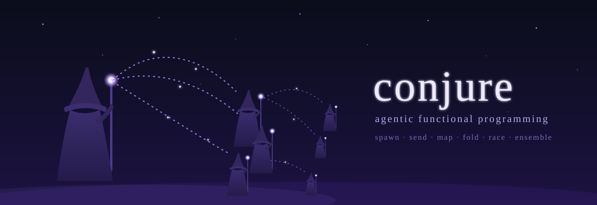

<p align="center">
  
</p>

# conjure

**Agentic functional programming.** A multi-agent harness built on
[`orchestral`](https://pypi.org/project/orchestral-ai/), organized around
three primitives — **recursive agent spawning**, **addressable mailboxes**,
and **capability passing** — with a library of FP-style combinators
(`agent_map`, `agent_fold`, `agent_filter`, `agent_race`, `agent_ensemble`,
`agent_critic`) built on top.

Most multi-agent frameworks bake in a topology — group chat,
supervisor/worker, DAG — and you fight the framework when your problem has
a different shape. Conjure inverts that: the primitives are the substrate,
and topology is ordinary code. The composition vocabulary is borrowed from
functional programming, where these problems have decades of prior art.

See [`DESIGN.md`](DESIGN.md) for the design philosophy and architecture.

## The three primitives

1. **Recursive spawning.** One root agent; every other agent is created by
   another agent via `spawn(spec) → address`. The spawn tree *is* the
   system's structure: callers own callees, lifecycle is parental,
   termination cascades.
2. **Addressable mailboxes.** Every live agent has a persistent, threaded,
   journaled inbox. Messages are async; parents are never blocked while
   children work. The user is just another address in the graph.
3. **Capability passing.** An agent can only message addresses it was
   given at spawn time or explicitly handed later. Possession of an
   address is permission — addresses compose like function references.

The load-bearing deviation from subagent-style frameworks: a spawned agent
does **not** vanish when it returns a value. It stays addressable — it can
be re-prompted, queried, and introduced to siblings — until its parent (or
the user) terminates it.

## Install

```bash
pip install conjure                 # core library + headless CLI (repl)
pip install "conjure[ui]"           # + the tmux/textual cockpit (conjure run)
pip install "conjure[claude_agent]" # + claude-agent-sdk engine
```

Requires Python ≥ 3.10 on POSIX (the daemon forks; Windows is unsupported).

## Quickstart — CLI

Point `conjure` at a YAML config describing the root agent:

```yaml
# agent.yaml
llms:
  default:
    provider: anthropic           # or openai / google / groq / ollama
    model: claude-haiku-4-5

root:
  role_prompt: |
    You are the root orchestrator. Spawn children when a specialist is
    warranted; otherwise just do the work.
  engine: orchestral
  llm: default
  tools: [primitive, combinator]
```

```bash
conjure config set ANTHROPIC_API_KEY sk-...   # stored in ~/.config/conjure/.env
conjure check agent.yaml                      # validate config + keys, no LLM calls
conjure repl agent.yaml                       # single-pane REPL, no tmux needed
conjure run agent.yaml                        # tmux cockpit (requires the [ui] extra)
```

In tmux mode the session is daemonized: window 0 is your prompt to the
root agent, every spawned agent gets its own live window, and `Ctrl+B M`
opens a meta-view popup (spawn tree + inboxes + cost). Detach with
`Ctrl+B d`, reattach with `conjure run --attach`, stop with `conjure quit`.

## Quickstart — library

The runtime is a plain Python object; engines are pluggable. This example
uses the deterministic `ScriptedEngine` (no API key needed) to show the
mechanics — swap in the `orchestral` or `claude_agent` engine factories
for LLM-backed agents (see `examples/`):

```python
from conjure import AgentSpec, BehaviorRegistry, Runtime, agent_map
from conjure.tools.primitives import send_impl

def squarer(engine, prompt, envelopes):
    for env in envelopes:
        body = env.body
        if isinstance(body, dict) and "item" in body:
            send_impl(token=engine.token, to=body["reply_to"], body=body["item"] ** 2)
    return "ok"

reg = BehaviorRegistry()
reg.register("idle", lambda *a, **kw: "idle")
reg.register("squarer", squarer)

rt = Runtime(engine_factory=reg.factory())
root = rt.root(AgentSpec(role_prompt="idle"))

squares = agent_map(
    rt, root,
    lambda _item: AgentSpec(role_prompt="squarer"),
    [1, 2, 3, 4, 5],
    timeout_s=5.0,
)
assert squares == [1, 4, 9, 16, 25]   # workers spawned, gathered, terminated
rt.shutdown()
```

## Combinators

All of these are ordinary code over the three primitives — and LLM-callable
tools, so agents can invoke them on their own subtrees:

| Combinator          | Shape                                                        |
|---------------------|--------------------------------------------------------------|
| `agent_map`         | Fan out one worker per item in parallel; gather in order     |
| `agent_fold`        | Thread an accumulator sequentially through workers           |
| `agent_filter`      | Classification swarm; keep items that pass                   |
| `agent_fixed_point` | Iterate an agent on its own output until it stabilizes       |
| `agent_race`        | Speculative execution: first reply wins, losers terminated   |
| `agent_ensemble`    | Best-of-N: gather all replies, synthesize via an aggregator  |
| `agent_critic`      | Generator/critic refinement loop with principled termination |

## Engines

- **`orchestral`** — wraps `orchestral.Agent`; multi-provider out of the
  box (Anthropic, OpenAI, Google, Groq, Ollama).
- **`claude_agent`** (`pip install "conjure[claude_agent]"`) — agents run
  as `claude-agent-sdk` sessions with Claude Code's full tool surface
  (Bash, Edit, Grep, …), per-agent sandbox directories, and permission
  routing.
- **`ScriptedEngine`** — deterministic behaviors for tests and offline
  development.

## Persistence & replay

Every spawn, send, and terminate is journaled to an append-only JSONL log
per session. `Runtime.replay(session_dir)` reconstructs the spawn tree and
all inbox contents for post-hoc inspection — every interaction in a
session is auditable.

## Limitations (v0.1)

Honest boundaries, documented rather than discovered:

- Single-process runtime; one OS thread per live agent.
- Termination does not interrupt an in-flight LLM call; it takes effect
  after the current step.
- Per-inbox FIFO ordering only — no global message order.
- Cost is tracked but not yet enforced as a ceiling.
- `agent_fixed_point` uses strict output equality, which stochastic LLMs
  rarely satisfy — prefer `agent_critic` for refinement loops.

See [`DESIGN.md`](DESIGN.md) §6 and §10 for where the FP framing breaks
down and which workloads the substrate fits poorly.

## Development

```bash
git clone <repo-url> && cd conjure
pip install -e ".[test,ui]"
pytest -q
```

## License

[AGPL-3.0-only](LICENSE). You can use, modify, and redistribute conjure
freely — but any distributed or network-served derivative must publish its
source under the same terms. For commercial licensing outside the AGPL,
contact the author.
